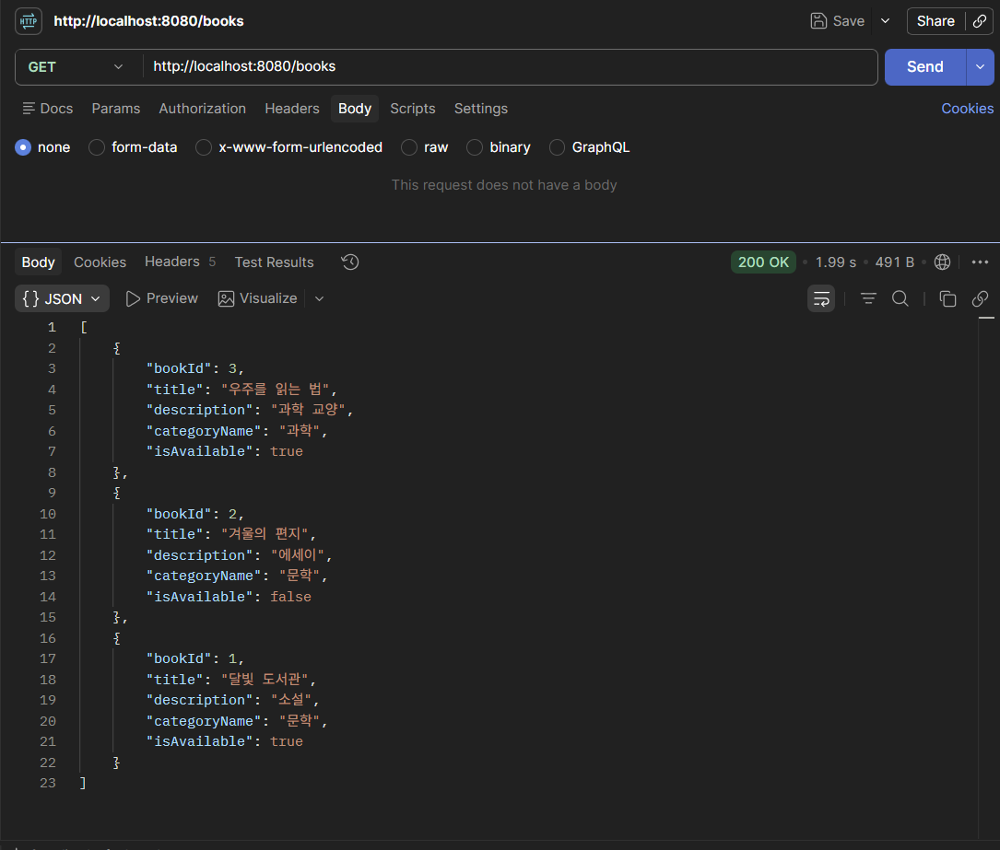
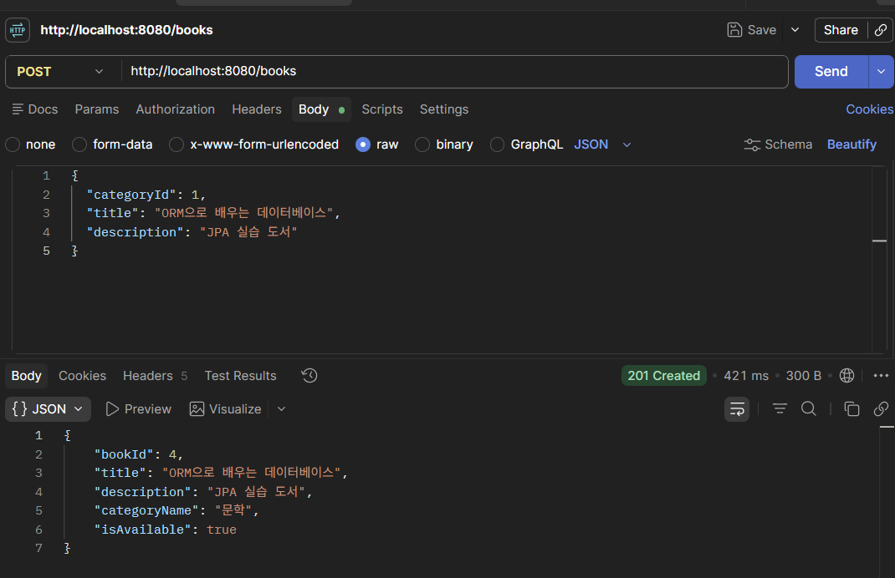
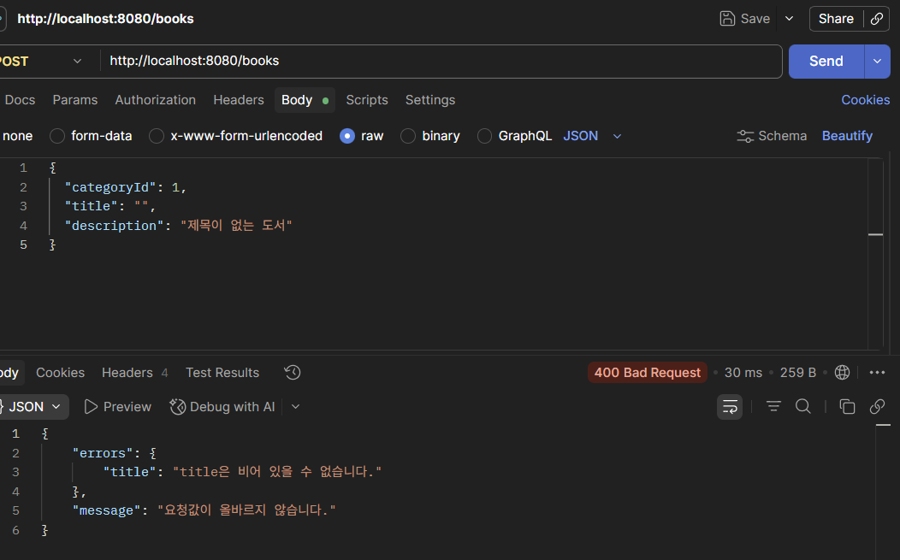
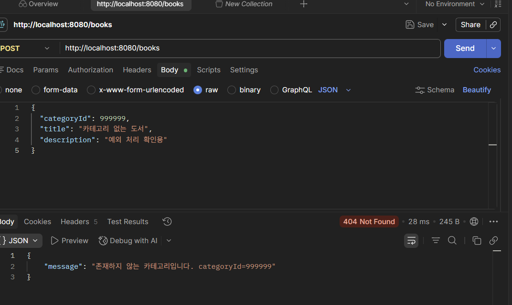

# 4주차 도서 API — Spring Data JPA

3주차의 `JdbcTemplate` 기반 도서 API를 Spring Data JPA로 리팩터링한 프로젝트입니다. 기존 MySQL 스키마 `umc_study`의 `book`, `category` 테이블을 그대로 사용합니다.

## 실행 준비

`.env.example`을 참고해 프로젝트 루트에 `.env`를 만들고 자신의 MySQL 접속 정보를 입력합니다. 스키마 이름은 `application.properties`에서 `umc_study` 하나로 고정합니다.

```properties
DB_HOST=127.0.0.1
DB_PORT=3306
DB_USERNAME=본인의 MySQL 사용자명
DB_PASSWORD=본인의 MySQL 비밀번호
```

기존 테이블을 임의로 변경하지 않도록 `spring.jpa.hibernate.ddl-auto=validate`와 `spring.jpa.open-in-view=false`를 사용합니다.

```powershell
$env:JAVA_HOME='C:\Program Files\Eclipse Adoptium\jdk-17.0.19.10-hotspot'
.\gradlew.bat bootRun
```

## GET /books

전체 도서를 도서 ID 내림차순으로 반환합니다. `EntityGraph`로 카테고리를 함께 조회하여 응답 변환 중 N+1 쿼리가 발생하지 않게 했습니다.

```http
GET http://localhost:8080/books
```

```json
[
  {
    "bookId": 3,
    "title": "우주를 읽는 법",
    "description": "과학 교양",
    "categoryName": "과학",
    "isAvailable": true
  }
]
```

## POST /books

```http
POST http://localhost:8080/books
Content-Type: application/json
```

```json
{
  "categoryId": 1,
  "title": "ORM으로 배우는 데이터베이스",
  "description": "JPA 실습 도서"
}
```

성공하면 `201 Created`와 생성된 도서를 반환합니다. 빈 제목이나 잘못된 ID는 `400 Bad Request`, 존재하지 않는 카테고리는 `404 Not Found`를 반환합니다.

## Postman 캡처 항목

1. `GET /books`의 `200 OK`와 최신순 도서 배열
2. `POST /books`의 요청 Body, `201 Created`, 생성된 도서 응답
3. 빈 제목 요청의 `400 Bad Request` 또는 없는 `categoryId` 요청의 `404 Not Found`

### GET /books — 200 OK

도서 ID, 제목, 설명, 카테고리 이름과 대여 가능 여부가 도서 ID 내림차순으로 반환됩니다.



### POST /books — 201 Created

존재하는 카테고리와 올바른 제목을 전달하면 신규 도서가 등록되고 `201 Created`가 반환됩니다.



### POST /books — 400 Bad Request

제목을 빈 문자열로 전달하면 DTO의 `@NotBlank` 검증이 적용되어 필드 오류가 반환됩니다.



### POST /books — 404 Not Found

존재하지 않는 `categoryId`를 전달하면 Service에서 카테고리를 확인한 뒤 `404 Not Found`를 반환합니다.



## Raw SQL 방식과 비교해 바뀐 점

3주차에는 SQL 문자열, 컬럼 별칭과 파라미터 순서를 Repository에서 직접 관리했습니다. 4주차에는 `Book`, `Category` 엔티티가 테이블과 관계를 표현하고 `JpaRepository`가 기본 SQL 생성을 담당합니다. 요청과 응답은 DTO로 분리하여 DB 컬럼 구조가 API 계약으로 직접 노출되지 않게 했습니다. 또한 `@Valid`로 요청 형식을 먼저 검사하고, Service에서 카테고리 존재 여부를 검증하도록 책임을 나눴습니다.

## 검증 문장

GET은 요구된 다섯 필드를 최신순으로 반환하고, POST는 검증된 요청으로 도서를 등록해 201을 반환하며 잘못된 요청과 없는 카테고리도 지정된 오류로 처리하므로 요구사항과 일치합니다.
