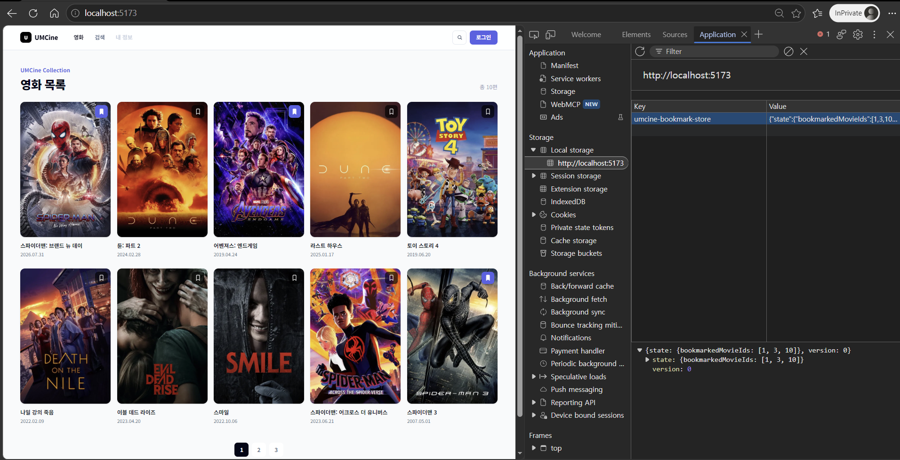

# 4주차 UMCine 북마크

3주차 UMCine 프로젝트의 북마크 상태를 Zustand 전역 저장소로 분리하고, 목록·검색·상세 화면에서 같은 상태를 사용하도록 연결했습니다. Zustand의 `persist` 미들웨어를 통해 북마크한 영화 ID만 브라우저의 Local Storage에 저장합니다.

## 실행

```powershell
npm ci
npm run dev
```

프로덕션 빌드와 TypeScript 검사는 다음 명령으로 확인합니다.

```powershell
npm run build
```

## Web Storage 확인

북마크를 변경하면 Application 패널의 Local Storage에 `umcine-bookmark-store` 키가 생성되고, `bookmarkedMovieIds` 배열에 선택한 영화 ID가 저장됩니다. 목록에서 변경한 북마크는 검색 및 상세 화면에서도 동일하게 표시되며 새로고침 후에도 유지됩니다. 저장값을 삭제한 뒤 앱을 새로고침하면 초기 빈 상태로 돌아갑니다.



## 검증 문장

목록·검색·상세 화면이 동일한 Zustand 상태를 사용하고 북마크 ID가 Local Storage에 저장·복원되므로 요구사항과 일치합니다.
